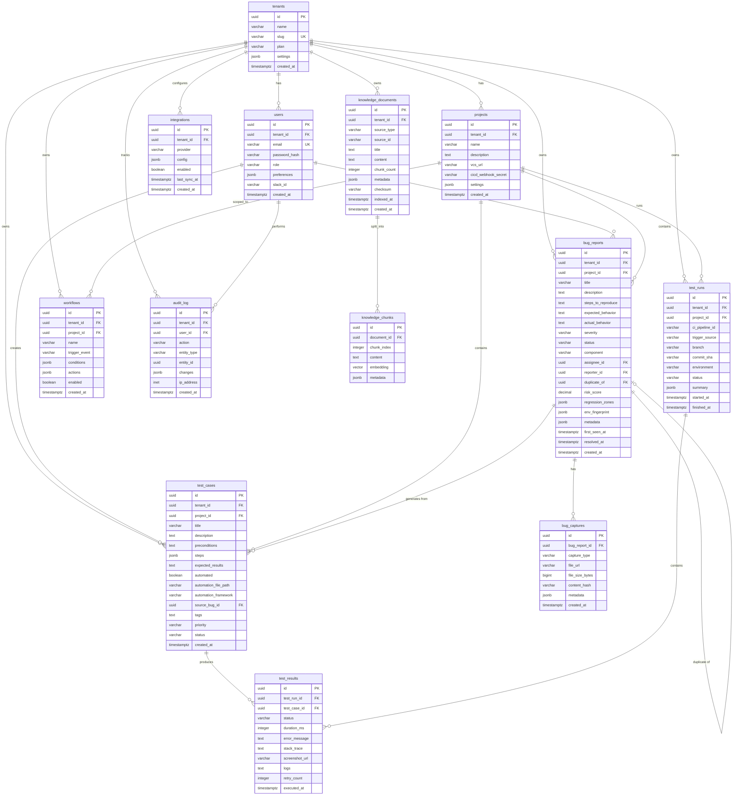

# Entity Relationship Diagram

```mermaid
erDiagram
    tenants ||--o{ users : has
    tenants ||--o{ projects : has
    tenants ||--o{ bug_reports : owns
    tenants ||--o{ test_cases : owns
    tenants ||--o{ test_runs : owns
    tenants ||--o{ workflows : owns
    tenants ||--o{ knowledge_documents : owns
    tenants ||--o{ integrations : configures
    tenants ||--o{ audit_log : tracks

    users ||--o{ bug_reports : "reports / assigned"
    users ||--o{ test_cases : creates
    users ||--o{ audit_log : performs

    projects ||--o{ bug_reports : contains
    projects ||--o{ test_cases : contains
    projects ||--o{ test_runs : runs
    projects ||--o{ workflows : scoped_to

    bug_reports ||--o{ bug_captures : has
    bug_reports ||--o{ test_cases : "generates from"
    bug_reports ||--o| bug_reports : "duplicate of"

    test_cases ||--o{ test_results : produces
    test_runs ||--o{ test_results : contains

    knowledge_documents ||--o{ knowledge_chunks : split_into

    tenants {
        uuid id PK
        varchar name
        varchar slug UK
        varchar plan
        jsonb settings
        timestamptz created_at
    }

    users {
        uuid id PK
        uuid tenant_id FK
        varchar email UK
        varchar password_hash
        varchar role
        jsonb preferences
        varchar slack_id
        timestamptz created_at
    }

    projects {
        uuid id PK
        uuid tenant_id FK
        varchar name
        text description
        varchar vcs_url
        varchar cicd_webhook_secret
        jsonb settings
        timestamptz created_at
    }

    bug_reports {
        uuid id PK
        uuid tenant_id FK
        uuid project_id FK
        varchar title
        text description
        text steps_to_reproduce
        text expected_behavior
        text actual_behavior
        varchar severity
        varchar status
        varchar component
        uuid assignee_id FK
        uuid reporter_id FK
        uuid duplicate_of FK
        decimal risk_score
        jsonb regression_zones
        jsonb env_fingerprint
        jsonb metadata
        timestamptz first_seen_at
        timestamptz resolved_at
        timestamptz created_at
    }

    bug_captures {
        uuid id PK
        uuid bug_report_id FK
        varchar capture_type
        varchar file_url
        bigint file_size_bytes
        varchar content_hash
        jsonb metadata
        timestamptz created_at
    }

    test_cases {
        uuid id PK
        uuid tenant_id FK
        uuid project_id FK
        varchar title
        text description
        text preconditions
        jsonb steps
        text expected_results
        boolean automated
        varchar automation_file_path
        varchar automation_framework
        uuid source_bug_id FK
        text tags
        varchar priority
        varchar status
        timestamptz created_at
    }

    test_runs {
        uuid id PK
        uuid tenant_id FK
        uuid project_id FK
        varchar ci_pipeline_id
        varchar trigger_source
        varchar branch
        varchar commit_sha
        varchar environment
        varchar status
        jsonb summary
        timestamptz started_at
        timestamptz finished_at
    }

    test_results {
        uuid id PK
        uuid test_run_id FK
        uuid test_case_id FK
        varchar status
        integer duration_ms
        text error_message
        text stack_trace
        varchar screenshot_url
        text logs
        integer retry_count
        timestamptz executed_at
    }

    workflows {
        uuid id PK
        uuid tenant_id FK
        uuid project_id FK
        varchar name
        varchar trigger_event
        jsonb conditions
        jsonb actions
        boolean enabled
        timestamptz created_at
    }

    integrations {
        uuid id PK
        uuid tenant_id FK
        varchar provider
        jsonb config
        boolean enabled
        timestamptz last_sync_at
        timestamptz created_at
    }

    knowledge_documents {
        uuid id PK
        uuid tenant_id FK
        varchar source_type
        varchar source_id
        text title
        text content
        integer chunk_count
        jsonb metadata
        varchar checksum
        timestamptz indexed_at
        timestamptz created_at
    }

    knowledge_chunks {
        uuid id PK
        uuid document_id FK
        integer chunk_index
        text content
        vector embedding
        jsonb metadata
    }

    audit_log {
        uuid id PK
        uuid tenant_id FK
        uuid user_id FK
        varchar action
        varchar entity_type
        uuid entity_id
        jsonb changes
        inet ip_address
        timestamptz created_at
    }
```
